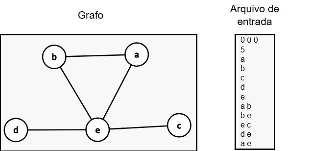

# Trabalho 1
**Universidade Federal de Juiz de Fora**
**Departamento de Ciência da Computação**
**DCC059 – Teoria dos Grafos – Turma A**
**Semestre 2025/1 - Profa Luciana Brugiolo - Tutor Rafael Freesz**
**Data entrega: 30/06**

Este documento traz a especificação do Trabalho 1, atividade avaliativa do tipo “Trabalho Prático”, e serve de base para todas as atividades de implementação cobradas ao longo do curso da disciplina DCC059 - Teoria dos Grafos no semestre letivo 2025-1.

Desenvolver um Tipo Abstrato de Dados - TAD ou uma Classe que represente grafos simples, que podem ser:
- Orientados ou não orientados, 
- Ponderados ou não ponderados (nos vértices e/ou nas arestas) 

Implemente o conjunto de funcionalidades apresentados a seguir, detalhadas em sala de aula. O desenvolvimento dos algoritmos contribui como base para a resolução das questões das avaliações teóricas.

## Orientações:

- Seu TAD ou Classe deve ser capaz de representar grafos utilizando **LISTA DE ADJACÊNCIA**;
- O código deve ser desenvolvido em linguagem C++ e você não deve usar funções que não sejam nativas da linguagem, pois isso pode levar à impossibilidade de compilar seu código no ambiente que será usado para testes;
- Além do atendimento às funcionalidades, alguns dos elementos avaliados são a clareza e a organização do código (nomes de funções e variáveis, comentários que indiquem o propósito das principais funções e procedimentos, inclusive explicando o que são os parâmetros e o retorno, em caso de função);
- O programa principal que usará o TAD ou a Classe Grafo deve ler os dados do grafo de entrada (direcionados ou não direcionados, ponderados ou não ponderados) a partir de arquivo texto. Cabe ao grupo ler o arquivo README que explica a semântica do arquivo de entrada. Entenda-se por formato do arquivo a estrutura em que os dados do grafo aparecem no texto. No exemplo a seguir, a primeira linha contém três valores binários que definem o tipo do grafo; se é direcionado, se é ponderado nos vértices e nas arestas, respectivamente. A segunda linha indica o número de vértices, as cinco linhas seguintes apresentam o id dos vértices e as demais linhas indicam as arestas.

- O nome do arquivo a ser lido deve ser informado ao programa via teclado para a função 
~~~c++
int main (int argc, char **argv)
~~~
para passar ao programa todas as informações necessárias ao seu funcionamento;

- Cada grupo enviará um único trabalho contendo **APENAS** os arquivos fonte (extensão cpp e h) e os arquivos de entrada utilizados (caso estes não tenham sido disponibilizados);
O padrão para compilação a ser utilizado (ambiente Linux ou IOS) será
~~~
g++ *.cpp -o execGrupoX
~~~
Onde “GrupoX” indica a qual grupo o trabalho se refere; 

- O padrão para a execução a ser utilizado pelo professor será a linha abaixo, executada em ambiente **Linux** ou **IOS**:
~~~
./execGrupoX <arquivo_entrada>
~~~
Onde *<arquivo_entrada>* é o nome do arquivo que contém as informações do grafo.

- O grupo deve enviar um ÚNICO arquivo compactado cujo nome deve ser **Trabalho_GrupoX.zip**. 
**Nota:** no arquivo zip deve ter incluso **APENAS** os arquivos com extensão cpp ou h e os arquivos das instâncias usadas no experimento.

- Este repositório contem o os arquivos com classes e funções que devem compor minimamente o trabalho. Fica à critério do grupo a inclusão de demais classes, atributos ou funções que venham a auxiliar no desenvolvimento do trabalho.

## Funcionalidades

O programa deve apresentar em tela a saída para as seguintes funções:

**A.** **Parâmetro:** um Id de um vértice de um grafo direcionado; **Saída:** o fecho transitivo direto deste vértice.
**B.** Parâmetro: um Id de um vértice de um grafo direcionado; **Saída:** o fecho transitivo indireto deste vértice.
**C.** **Parâmetro:** dois IDs de vértices do grafo; **Saída:** o caminho mínimo entre estes dois vértices usando algoritmo de Djkstra;
**D.** **Parâmetro:** dois IDs de vértices do grafo; **Saída:** o caminho mínimo entre estes dois vértices usando algoritmo de Floyd;
**E.** **Parâmetro:** um subconjunto X de vértices do grafo; **Saída:** uma Árvore Geradora Mínima sobre o subgrafo vértice-induzido por X usando o algoritmo de Prim;
**F.** **Parâmetro:** um subconjunto X de vértices do grafo; **Saída:** uma Árvore Geradora Mínima sobre o subgrafo vértice-induzido por X usando o algoritmo de Kruskal;
**G.** **Parâmetro:** um ID de vértice;**Saída:** a árvore dada pela ordem de caminhamento em profundidade a partir de nó dado parâmetro, destacando as arestas de retorno;
**H.** **Parâmetro:** o grafo (direcionado ou não direcionado) ponderado nas arestas; **Saída:** O raio, o diâmetro, o centro e a periferia do grafo.

## Perguntas Frequentes

1.	***Quantos membros um grupo pode ter?***
O trabalho pode ter no máximo 4 pessoas. Mas, caso haja interesse de fazer o trabalho individualmente, você deve estar ciente de que, uma vez informado ao professor, não poderá integrar um outro grupo.
2.	***O projeto poderá ter mais de um arquivo fonte (cpp e h)?***
Pode (e, para boa organização do código, deve). Como usual, a especificação do trabalho descreve somente a interface a ser implementada. A organização do projeto é livre.
3.	***O que será levado em conta na correção?***
Na correção do código serão levados em conta (entre outros) os seguintes elementos.
    1.	Conformidade com a especificação.
    2.	Correção da implementação.
    3.	Eficiência da implementação.
    4.	Interação com o professor/tutor;
    5.	Organização e clareza do código (nomes de funções e variáveis, comentários etc).
4.	***Por que a especificação de como o programa será executado é importante?***
Porque o trabalho entregue será processado por um script que considera que a especificação de entrega foi corretamente observada.
5.	***O que acontece se a especificação de execução do programa não for corretamente observada?***
Seu trabalho só será corrigido quando houver tempo de fazer manualmente. Por isso, haverá desconto na sua nota, proporcional ao trabalho de processamento que tenha que ser feito manualmente.
6.	***Meu trabalho tem um bug. O que vai acontecer com minha nota?***
Você deve informar isso no relatório e haverá algum desconto na nota, dependendo da gravidade que o bug implicar no funcionamento. Se o problema afetar alguma das funcionalidades requeridas, o desconto será proporcional ao que estiver faltando.
7.	***Meu código não compila. Posso enviar assim mesmo?***
Não serão avaliados trabalhos com erros de compilação. Por isso a importância de se usar apenas funções do padrão Ansi.
8.	***Tenho outra pergunta/dúvida a respeito do trabalho.***
Procure o professor ou o tutor para tirar suas dúvidas no horário de atendimento ou durante as aulas.
